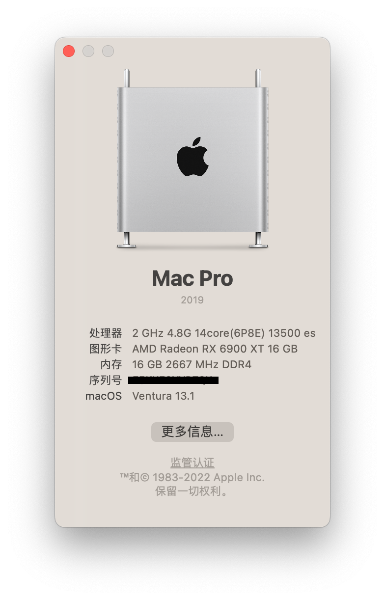

# Hackintosh_MAXSUN_H610ITX_13500es
适用于13代(Raptor lake)+铭瑄H610ITX黑苹果引导文件

OpenCore 0.8.8，机型可选MacPro或iMac，系统为 Ventura 13.1

# 配置

| 配置        | 型号                   |
|-----------|----------------------|
| CPU       | intel i5 13500es       |
| 主板        | 铭瑄挑战者 H610ITX  2.5G      |
| 显卡        | 6900XT              |
| SSD       | HOF extreme 1T          |
| 网卡    | BCM94352Z          |

## 正常驱动
* 声卡
* USB接口
* 音量调节
* 有线网卡
* 无线网卡
* 睡眠唤醒
* 隔空投送
* 接力

## 无法驱动
* 随航无法使用

# BIOS设置
铭瑄BIOS从1.4版本开始支持RaptorLake，但官方[BIOS](http://www.maxsun.com.cn/2022/0512/5728.html)v1.4g默认开启了cfglock，使用cfglock.efi/grub/ru.efi等方法均不能解锁cfglock，不得已基于1.4版本魔改了一份BIOS，默认解锁cfglock。
据说OpenCore可以通过开启Quirks选项AppleCpuPmCfgLock跳过，但我没试过

以下设置均基于1.4g版的BIOS（按照在BIOS里出现的顺序排序）
* 开启Hyper-Threading
* 关闭VT-d
* 开启Above 4G decoding
* 开启Resizable Bar
* 关闭Device Security Support
* 关闭Serial/COM Port
* 开启EHCI/XHCI Hand-off
* 关闭CSM Support
* 关闭Fast Boot
* 关闭Secure Boot

# 制作启动盘
* 用rufus.exe格式化U盘，选择 非可引导 FAT32(U盘)或Large FAT32(外置硬盘)
* 下载[OpenCore](https://github.com/acidanthera/OpenCorePkg)，用其中macrecovery工具（需要python环境）下载macos，放入U盘
* 将EFI文件装入U盘
* 下载[OCAT](https://github.com/ic005k/OCAuxiliaryTools/releases)，读取EFI\OC目录下的config.plist，检查更新并生成新的三码信息
* BIOS里选择从U盘启动，按指示安装即可

# PS.其他
本机的ACPI文件，可以使用[SSDTTime](https://github.com/corpnewt/SSDTTime)快速生成

SMCProcessor.kext和选项ProvideCurrentCpuInfo不兼容，只能二选一

NVRAM的boot-args添加-v可以看到报错信息，或者在[开机时按Command-V](https://support.apple.com/zh-cn/HT201255)

# 截图展示

